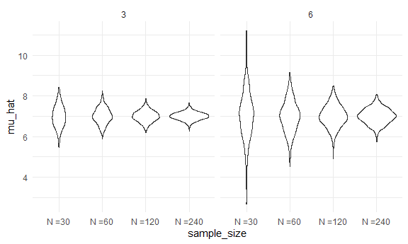

Simulations
================

## Simulations!!

Here’s our function from before.

``` r
sim_mean_sd = function(n_obs, mu = 7, sigma = 4) {
  
  x = rnorm(n = n_obs, mean = mu, sd = sigma)


  tibble(
    mu_hat = mean(x),
    sigma_hat = sd(x)
  )
  
}
```

How did we use this before?

``` r
sim_mean_sd(n_obs = 30)
```

    ## # A tibble: 1 × 2
    ##   mu_hat sigma_hat
    ##    <dbl>     <dbl>
    ## 1   6.83      3.83

How can we use this now…

Let’s start with a for loop!

``` r
output = vector("list", length = 100)

for (i in 1:100) {
  
  output[[i]] = sim_mean_sd(n_obs = 30)
}

bind_rows(output)
```

    ## # A tibble: 100 × 2
    ##    mu_hat sigma_hat
    ##     <dbl>     <dbl>
    ##  1   5.92      3.41
    ##  2   7.62      3.01
    ##  3   5.31      4.09
    ##  4   5.85      3.14
    ##  5   5.84      3.23
    ##  6   7.48      4.92
    ##  7   6.69      4.22
    ##  8   6.08      4.30
    ##  9   8.15      4.66
    ## 10   7.77      4.17
    ## # … with 90 more rows

Lets’ use list columns instead.

``` r
sim_results_df = 
  expand_grid(
    sample_size = 30,
    interation = 1:100
  ) %>%
  mutate(
    estimate_df = map(sample_size, sim_mean_sd)
  ) %>%
  unnest(estimate_df)
```

``` r
sim_results_df %>%
  ggplot(aes(x = mu_hat)) +
  geom_density()
```


!!!!!!!!!!!!!!!!!!!!!!!!!!!

## what about changing the sample size?

I need a input list with lots of sample size.

``` r
sim_results_df = 
  expand_grid(
    sample_size = c(30, 60, 120, 240),
    interation = 1:1000
  ) %>%
  mutate(
    estimate_df = map(sample_size, sim_mean_sd)
  ) %>%
  unnest(estimate_df)
```

``` r
sim_results_df %>%
  mutate(
    sample_size = str_c("N =", sample_size),
    sample_size = fct_inorder(sample_size)
  ) %>%
  ggplot(aes(x = sample_size, y = mu_hat)) +
  geom_violin()
```


``` r
sim_results_df %>%
  mutate(
    sample_size = str_c("N =", sample_size),
    sample_size = fct_inorder(sample_size)
  ) %>%
  group_by(sample_size) %>%
  summarize(
    emp_st_err = sd(mu_hat)
  )
```

    ## # A tibble: 4 × 2
    ##   sample_size emp_st_err
    ##   <fct>            <dbl>
    ## 1 N =30            0.710
    ## 2 N =60            0.524
    ## 3 N =120           0.373
    ## 4 N =240           0.262

## Let’s see two inputs…

``` r
sim_results_df = 
  expand_grid(
    sample_size = c(30, 60, 120, 240),
    true_sigma = c(6,3),
    interation = 1:1000
  ) %>%
  mutate(
    estimate_df = 
      map2(.x = sample_size, .y = true_sigma, ~sim_mean_sd(n_obs = .x, sigma = .y))
  ) %>%
  unnest(estimate_df)
```

``` r
sim_results_df %>%
  mutate(
    sample_size = str_c("N =", sample_size),
    sample_size = fct_inorder(sample_size)
  ) %>%
  ggplot(aes(x = sample_size, y = mu_hat)) +
  geom_violin() +
  facet_grid(. ~ true_sigma)
```


